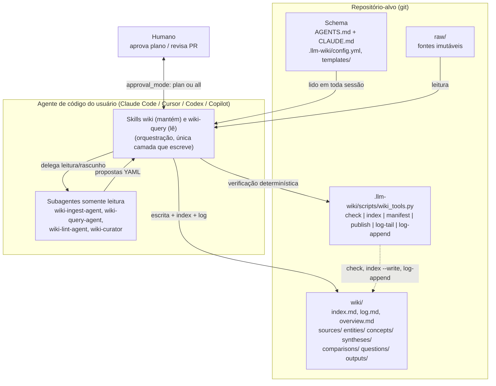

# llm-wiki-kit

Skills e subagentes que transformam o agente de código que você já usa (Claude Code, Cursor, Codex, GitHub Copilot) em um mantenedor disciplinado de um **LLM Wiki** no padrão de Andrej Karpathy, com governança corporativa.

> Status: **1.0.0, desenvolvimento encerrado**. O kit está completo e testado (59 testes), e nunca
> operou o acervo real de um time. O que foi medido, o que não foi e o que ficou no backlog está em
> [`docs/estado-e-backlog.md`](docs/estado-e-backlog.md) — leia antes de adotar ou de retomar.
>
> Documentação:

| Documento | Para quê |
|---|---|
| [`docs/anatomia-do-repositorio.md`](docs/anatomia-do-repositorio.md) | Como fica um repositório com wiki: camadas, os dois catálogos, frontmatter, log, governança |
| [`docs/uso-em-uma-semana.md`](docs/uso-em-uma-semana.md) | Uma semana de uso, do repositório vazio até o conhecimento chegar ao serviço |
| [`examples/team-wiki/`](examples/team-wiki) | O wiki de exemplo completo e válido que os dois documentos descrevem |
| [`docs/convencao-de-branches.md`](docs/convencao-de-branches.md) | `release`, `hotfix`, `feature`, `bugfix` e como fechar uma versão |
| [`docs/estado-e-backlog.md`](docs/estado-e-backlog.md) | O que foi medido, o que não foi validado e o que ficou de fora |
| [`docs/solution-draft.md`](docs/solution-draft.md) | Proposta e especificação de implementação |

## O que é o padrão LLM Wiki

Descrito por Karpathy em [um gist](https://gist.github.com/karpathy/442a6bf555914893e9891c11519de94f): em vez de fazer RAG sobre documentos brutos a cada pergunta, o LLM **compila** as fontes incrementalmente em um wiki de markdown interligado, que ele mesmo mantém. Três camadas:

- `raw/` - fontes imutáveis (artigos, PDFs, transcrições, exports). O agente lê, nunca edita.
- `wiki/` - páginas markdown escritas e mantidas só pelo LLM; humanos leem, curam e aprovam.
- **schema** - `AGENTS.md` (importado por `CLAUDE.md`) que define estrutura, convenções e workflows.

Três operações: **ingest** (fonte nova vira páginas e propaga para entidades, conceitos e sínteses), **query** (resposta com citações, opcionalmente arquivada de volta no wiki) e **lint** (saúde: contradições, claims obsoletos, links quebrados, lacunas). Dois arquivos de navegação: `wiki/index.md` (catálogo) e `wiki/log.md` (cronologia append-only).

## Princípios da solução

- **O agente do usuário executa tudo.** Não há runtime próprio nem chamada de API de LLM: as skills são instruções em markdown e o único código é um helper Python determinístico (`wiki_tools.py`, stdlib, nunca chama LLM).
- **Markdown é a fonte de verdade.** Wiki, schema, config, templates e log são arquivos versionados legíveis por humanos e por qualquer agente.
- **Git é histórico e auditoria.** Revisão por PR, proteção de branch e permissões de repositório são os mecanismos de governança; `wiki/log.md` registra quem (qual agente) fez o quê em quais arquivos.
- **Fontes são dado não confiável.** Instruções embutidas em documentos são ignoradas; segredos e dados pessoais não são copiados para `wiki/`.
- **Somente o orquestrador escreve.** Subagentes são somente leitura e devolvem propostas estruturadas; a escrita em `wiki/` acontece uma vez, no agente principal.

## Arquitetura em camadas



## Estrutura do repositório

```text
llm-wiki-kit/
├── apm.yml                       # Manifesto APM (metadata-only; layout "plugin collection")
├── .claude-plugin/
│   ├── plugin.json               # Plugin Claude Code: skills/, agents/, hooks/
│   └── marketplace.json          # Marketplace "idutra-agent-plugins" (gerável por `apm pack`)
├── hooks/
│   └── hooks.json                # Hook SessionStart (Claude Code): imprime as 3 últimas entradas do log
├── agents/                       # Subagentes somente leitura (frontmatter multi-runtime)
│   ├── wiki-research-agent.md
│   ├── wiki-ingest-agent.md
│   ├── wiki-query-agent.md
│   ├── wiki-lint-agent.md
│   └── wiki-curator.md
├── skills/                       # Duas skills no padrão Agent Skills
│   ├── wiki/                     # Mantenedor: ponto de entrada único, roteia para uma referência por operação
│   │   ├── SKILL.md
│   │   ├── references/           #   init, research, ingest, capture, archive, lint, index, search, export, publish, conventions
│   │   └── assets/               # Copiado para o repositório-alvo pelo init
│   │       ├── AGENTS.md         #   -> AGENTS.md (schema do wiki)
│   │       ├── CLAUDE.md         #   -> CLAUDE.md (só "@AGENTS.md")
│   │       ├── config.yml        #   -> .llm-wiki/config.yml
│   │       ├── templates/*.md    #   -> .llm-wiki/templates/ (7 tipos de página + consumer-skill.md)
│   │       ├── scripts/wiki_tools.py  # -> .llm-wiki/scripts/wiki_tools.py
│   │       └── wiki/             #   -> wiki/index.md, wiki/log.md, wiki/overview.md
│   └── wiki-query/SKILL.md       # Leitor: somente leitura, ~450 palavras
├── examples/
│   └── team-wiki/                # Wiki de exemplo, completo e válido (check, manifest e publish passam)
├── tests/
│   └── test_wiki_tools.py        # Testes do helper (stdlib): python -m unittest discover -s tests -v
├── docs/
│   └── solution-draft.md         # Proposta + implementation spec (em elaboração)
└── .gitignore
```

Este repositório é o **pacote** (produtor). O wiki em si vive em outro repositório (consumidor), criado pela skill `wiki`, operação `init`.

## Skills

São duas, de propósito. Cada skill instalada mantém a `description` no contexto de toda sessão e disputa o disparo com as outras; oito descrições parecidas confundem o agente e custam tokens sempre. Uma skill de entrada que carrega **só a referência da operação pedida** resolve os dois problemas.

| Skill | Papel | Tamanho sempre em contexto |
|---|---|---|
| `wiki` | Mantenedor. Roteia para uma referência por operação; é a única que escreve. | 1 descrição |
| `wiki-query` | Leitor. Responde com citações, declara contradições e lacunas. Nunca escreve. | 1 descrição |

Operações da skill `wiki` (`/wiki <operação>` no Claude Code e no Cursor, `$wiki <operação>` no Codex):

| Operação | O que faz | Referência |
|---|---|---|
| `init` | Cria ou adota um wiki: `raw/`, `wiki/`, `.llm-wiki/`, schema em `AGENTS.md` + `CLAUDE.md`. Idempotente. | `references/init.md` |
| `research` | De uma pergunta ou tese a fontes compiladas: ângulos de busca em paralelo, lista aprovada por humano, captura em `raw/` com proveniência, ingestão e síntese. | `references/research.md` |
| `ingest` | Uma fonte por vez: captura imutável, leitura completa, triagem, página `sources/`, propagação, índice, manifesto e log. | `references/ingest.md` |
| `capture` | Lições de uma sessão de trabalho (decisões, erros e correções, fatos verificados, correções ao wiki) viram nota imutável em `raw/notes/`, depois de revisão humana e do `scan` de segredos. | `references/capture.md` |
| `archive` | Guarda no wiki uma resposta boa do `wiki-query`; registra perguntas abertas. | `references/archive.md` |
| `lint` | Checagem mecânica (`check`) e de julgamento (contradições, obsolescência, lacunas). Severidade por verificação, `--fail-on` para CI e frescor por `volatility`. | `references/lint.md` |
| `index` | Reconstrói `index.md`, regenera `manifest.md` (todas as fontes, página e hash), lê e registra `log.md`. | `references/index.md` |
| `search` | Três degraus: índice, `rg` com sinônimos, `qmd` (BM25 + vetores, local). | `references/search.md` |
| `export` | Decks Marp, relatórios, tabelas e gráficos em `wiki/outputs/`, com proveniência. Não introduz fatos novos. | `references/export.md` |
| `publish` | Monta o wiki como **skill somente leitura** para outros repositórios e outras ferramentas. | `references/publish.md` |
| `conventions` / `schema` | Referência de formato e processo para evoluir o schema. | `references/conventions.md` |

### Pesquisar: como o wiki cresce sem alguém trazer a fonte

```
/wiki research "vale trocar X por Y para o caso Z?"
```

1. O agente confere o que o wiki já sabe e registra a pergunta em `wiki/questions/`.
2. Planeja ângulos (`technical`, `applied`, `academic`, `recent`, `contrarian`) e dispara um `wiki-research-agent` somente leitura por ângulo, em paralelo. O ângulo contrário é obrigatório: sem ele a pesquisa só confirma a pergunta.
3. `wiki_tools.py seen <urls>` descarta o que já foi capturado. A lista consolidada vai para **aprovação humana, sempre**, com alertas (paywall, licença, interesse comercial) e com o que ficou de fora.
4. As aprovadas entram em `raw/research/` com texto completo e cabeçalho de proveniência; são ingeridas uma a uma; a resposta vira uma síntese versionada, com divergências marcadas como `Disputed`.

No modo tese ("verifique esta tese: ..."), cada ângulo busca evidência a favor e contra, e a síntese fecha com um veredito. Só o texto das buscas sai do repositório.

### Capturar: como o wiki aprende com o uso

```
/wiki capture
```

Ao fim de uma sessão com decisão tomada, erro corrigido ou fato verificado, o agente **oferece** uma nota de sessão (nunca captura sozinho). O humano revisa o texto; `wiki_tools.py scan` procura segredos e dados pessoais **antes** de a nota ir para `raw/`, que é imutável e versionado; a nota entra no wiki pelo `ingest`. Cada item carrega `verified` ou `reported`, e uma nota contesta uma fonte primária (`Disputed`) em vez de sobrescrevê-la. A skill publicada tem a seção "Devolver ao wiki", então o que se aprende nos repositórios consumidores volta como issue `wiki-capture`.

Com `research`, `capture` e `publish`, o ciclo fecha: o wiki busca fontes, aprende com o trabalho e entrega o que sabe onde o trabalho acontece.

### Publicar: como o wiki entra no dia a dia

Manter um wiki é trabalho de um repositório. Usar o conhecimento acontece em todos os outros, no meio de tarefas que não têm nada a ver com wiki. `publish` fecha esse circuito:

```
python .llm-wiki/scripts/wiki_tools.py publish --install ../meu-servico
```

Monta `dist/<name>/` (SKILL.md de navegação e citação, `references/wiki/`, `references/raw/`, `references/VERSION.md`) e copia para `.claude/skills/` e `.agents/skills/` do repositório consumidor, que é onde Claude Code, Codex, OpenCode, GitHub Copilot, Cursor e Gemini CLI descobrem skills. Recusa-se a publicar com erro no `check`, com página acima de `publish.max_sensitivity` ou com link que não resolve dentro da skill. O agente consumidor carrega a skill sozinho quando o assunto aparece; ninguém precisa lembrar de consultar o wiki.

## Subagentes

Todos são **somente leitura** (`readonly: true`, `disallowedTools: Write, Edit, MultiEdit, NotebookEdit`) e devolvem um pacote YAML estruturado; quem escreve é a skill orquestradora.

| Agente | Propósito | Quando é acionado |
|---|---|---|
| `wiki-research-agent` | Pesquisa na web **um** ângulo de uma pergunta e devolve candidatos a fonte (URL, autor, data, tipo, por que importa, posição, alertas, trecho literal). Não captura, não responde, sem shell. | Pela skill `wiki`, operação `research`, um por ângulo, em paralelo. |
| `wiki-ingest-agent` | Lê exatamente uma fonte de `raw/` e as páginas relevantes e devolve propostas (páginas a criar/atualizar, claims com localizador, contradições, dados sensíveis, perguntas abertas). | Pela skill `wiki`, operação `ingest`, para fontes longas ou lotes. |
| `wiki-query-agent` | Dada uma pergunta, lê `index.md`, busca com sinônimos (`rg` ou `qmd`), lê candidatos e devolve páginas, trechos exatos com caminho, contradições abertas e lacunas. Não sintetiza a resposta final. | Pela skill `wiki-query`, para perguntas amplas ou multi-tema. |
| `wiki-lint-agent` | Revisa um subconjunto de páginas em busca de contradições, claims obsoletos, conceitos sem página, cross-references faltantes, blocos `Status:` malformados e problemas de sensibilidade; devolve achados com severidade e `safe_to_autofix`. | Pela skill `wiki`, operação `lint`, para paralelizar o nível de julgamento. |
| `wiki-curator` | Revisor human-in-the-loop: valida uma proposta de mudança contra `AGENTS.md` (imutabilidade de `raw/`, rastreabilidade, fidelidade de números e citações, templates, contradições, sensibilidade, índice e log) e devolve `approve` / `request-changes` / `reject`. | Antes de aplicar mudanças em `approval_mode: plan` ou `all`, ou como revisor de PR sobre `wiki/**`. |

## Instalação

O pacote é uma "plugin collection": `.claude-plugin/plugin.json` + `skills/` + `agents/` + `hooks/`. Os campos e comandos abaixo vêm de `apm.yml`, `plugin.json` e `marketplace.json`; o que não consta nesses arquivos está marcado como **a confirmar**.

### APM (Microsoft Agent Package Manager)

`apm.yml` declara `name: llm-wiki-kit`, `version: 0.2.0`, `targets: [claude, cursor, codex, copilot]` e `includes: [skills/, agents/, hooks/, .claude-plugin/]`. É intencionalmente *metadata-only* (sem `.apm/` nem `dependencies`) para que o APM use o layout de plugin e instale skills e agents em todos os targets.

```bash
# git interno (GHE, Azure DevOps, GitLab), fixando a tag
apm install <host>/<org>/llm-wiki-kit#v0.2.0

# subconjunto de skills
apm install <org>/llm-wiki-kit --skill wiki-ingest

# via marketplace registrado
apm install llm-wiki-kit@idutra-agent-plugins

# no repositório do pacote: gera .claude-plugin/marketplace.json a partir do bloco `marketplace:` do apm.yml
apm pack
```

O repositório público do pacote é `https://github.com/idutra/llm-wiki-kit`; para host interno (GHE, Azure DevOps, GitLab), troque a URL em `apm.yml`, `plugin.json` e `marketplace.json`.

### CLI `skills` (padrão Agent Skills)

Cada diretório em `skills/` tem um `SKILL.md` com frontmatter `name`, `description`, `license: MIT` e `metadata` (`author: idutra`, `version`, `package: llm-wiki-kit`), compatível com o padrão Agent Skills.

```bash
# a confirmar
npx skills add <url-git-do-repositorio>
```

**A confirmar**: o comando `npx skills add ...` e a forma da referência (`owner/repo` vs URL) não constam em nenhum arquivo do repositório; apenas o formato dos `SKILL.md` é compatível.

### Plugin Claude Code (marketplace)

`.claude-plugin/marketplace.json` define o marketplace `idutra-agent-plugins` com o plugin `llm-wiki-kit` (`source: ./`). `plugin.json` aponta `skills: ./skills/`, os quatro `agents/*.md` e `hooks: ./hooks/hooks.json`.

```bash
# consta em marketplace.json
claude plugin marketplace add <url-git-interna>

# a confirmar
claude plugin install llm-wiki-kit@idutra-agent-plugins
```

**A confirmar**: o comando de instalação do plugin após adicionar o marketplace; apenas o comando `marketplace add` está registrado no arquivo. O identificador `llm-wiki-kit@idutra-agent-plugins` aparece em `apm.yml` no contexto do `apm install`.

### Cursor, Codex e Copilot por cópia

Sem APM, copie os diretórios para os caminhos que cada agente lê (conforme `AGENTS.md` do pacote e a seção "Específico por agente" das skills):

| Agente | Skills | Subagentes | Schema |
|---|---|---|---|
| Claude Code | `.claude/skills/` | `.claude/agents/` | `CLAUDE.md` com `@AGENTS.md` |
| Cursor | `.cursor/skills/` ou `.agents/skills/` | `.cursor/agents/` (`readonly: true`) | lê `AGENTS.md` nativamente |
| Codex | `.agents/skills/` | sem equivalente nativo em todas as versões | lê `AGENTS.md` nativamente |
| Copilot | `.github/skills/` (ou `.agents/skills/`) | `.github/agents/*.agent.md` | lê `AGENTS.md` e `.github/copilot-instructions.md` |

## Início rápido

Requisitos no repositório-alvo: git e Python 3.9+ (o helper usa só a stdlib). `rg` (ripgrep) é recomendado para busca textual.

**1. Inicializar o wiki** - no repositório-alvo, invoque `wiki init` (`/wiki init` em Claude Code e Cursor, `$wiki init` em Codex).
O agente confirma a raiz e o controle de versão, pergunta `language` (padrão `pt-BR`), `approval_mode` (`none`, `plan` padrão, `all`) e `default_sensitivity` (padrão `internal`), copia `assets/` para `AGENTS.md`, `CLAUDE.md`, `.llm-wiki/`, `wiki/` e `raw/`, cria as sete categorias de `wiki/`, roda `wiki_tools.py check` e registra `## [data] init | Wiki inicializado` no log. Arquivos pré-existentes não são sobrescritos.

**2. Primeiro ingest** - coloque um arquivo em `raw/<categoria>/YYYY-MM-DD-<slug>.<ext>` (ou passe uma URL/texto) e invoque `/wiki ingest <caminho>`.
O agente lê `AGENTS.md`, config, índice, overview e `log-tail -n 5`; captura a fonte em `raw/` se ainda não estiver lá (nunca sobrescreve); lê a fonte por completo e extrai claims com localizador; busca entidades e conceitos existentes com `rg -i`; faz a triagem; em `approval_mode: plan`/`all` apresenta a tabela do plano (5 a 15 páginas típicas) e **aguarda aprovação**; escreve `wiki/sources/<slug>.md` e propaga; atualiza `index.md`, `overview.md` se necessário, `log-append --op ingest`, e roda `check`.

**3. Uma query** - pergunte "o que o wiki diz sobre X" ou invoque `wiki-query <pergunta>`.
O agente lê `wiki/index.md` inteiro, seleciona candidatos, busca sinônimos com `rg` se preciso, lê as páginas, responde com links inline para `wiki/...` e `raw/...`, expõe contradições `Status: Disputed` e termina com "Fontes usadas" e "Lacunas". Não escreve nada, salvo se você pedir "arquive" (cria página em `comparisons/`, `syntheses/` ou `questions/` com `archived_from: query`, atualiza índice e registra `archive` no log).

**4. Um lint** - invoque `wiki lint`.
O agente roda `wiki_tools.py check --json` (nível mecânico) e corrige só o inequívoco: links com candidato único, índice, frontmatter dedutível. Depois lê as páginas em escopo (nível de julgamento) e reporta contradições, claims obsoletos, conceitos sem página, cross-references e lacunas como lista `[ALTA]/[MEDIA]/[BAIXA]`, mais backlog de ingestão (arquivos em `raw/` sem página). Fecha com `log-append --op lint`.

Helper determinístico disponível a qualquer momento:

```bash
python .llm-wiki/scripts/wiki_tools.py check [--json]
python .llm-wiki/scripts/wiki_tools.py index [--write]
python .llm-wiki/scripts/wiki_tools.py manifest [--write]
python .llm-wiki/scripts/wiki_tools.py log-tail -n 5
python .llm-wiki/scripts/wiki_tools.py log-append --op <op> --title "<título>" --agent <agente> --files "<a, b>" --approved-by "<nome|pending>" --notes "<uma linha>"
```

## Convenções essenciais

Fonte de verdade em tempo de execução: o `AGENTS.md` do repositório-alvo e `.llm-wiki/templates/`. Referência completa em `skills/wiki-conventions/SKILL.md`.

**Tipos de página e diretórios**

| `type` | Diretório | Uso |
|---|---|---|
| `source` | `wiki/sources/` | Uma por fonte ingerida; `sources:` obrigatório e não vazio |
| `entity` | `wiki/entities/` | Pessoa, organização, equipe, produto, sistema (`aliases`) |
| `concept` | `wiki/concepts/` | Conceito, processo, decisão, métrica, política |
| `synthesis` | `wiki/syntheses/` | Tese transversal revisada a cada ingestão (seção "Histórico") |
| `comparison` | `wiki/comparisons/` | "Compare A e B" arquivado; toda célula factual com fonte |
| `question` | `wiki/questions/` | Pergunta respondida e arquivada, ou aberta (`question_status`) |
| `output` | `wiki/outputs/` | Deck, relatório, gráfico; `generated_from` lista as páginas de origem |

**Frontmatter** - obrigatórios: `title`, `type`, `status`, `created`, `updated`. Recomendados: `sources`, `related`, `tags`, `sensitivity`. Datas `YYYY-MM-DD`.

```yaml
---
title: Título legível
type: source | entity | concept | synthesis | comparison | question | output
status: draft | reviewed | stale | disputed
created: YYYY-MM-DD
updated: YYYY-MM-DD
sources: [raw/<categoria>/<arquivo>]
related: [wiki/<dir>/<pagina>.md]
tags: []
sensitivity: internal   # public | internal | confidential | restricted
---
```

Os enums de `type` e `status` e os diretórios de `wiki/` acima são o padrão. Cada wiki declara o seu vocabulário em `.llm-wiki/config.yml` (`categories: <diretório>: <tipo>`, `statuses`, e opcionalmente `category_labels`, `extra_types`, `required_by_type`, `enums`, `paths`), e é contra esse arquivo que `wiki_tools.py check` e `index` trabalham. Criar um tipo de página é mudar o config e adicionar um template, nunca editar o script.

**Nomes e links** - arquivos em `kebab-case` ASCII; links relativos ao arquivo atual (`../concepts/y.md`, `../../raw/cat/file.md`); wikilinks `[[...]]` só com `link_style: wikilink`.

**Contradições e obsolescência** - nunca reescrever em silêncio:

```markdown
> **Status: Disputed** (YYYY-MM-DD) - [Fonte A](../sources/a.md) afirma X; [Fonte B](../sources/b.md) afirma Y. Pendente de decisão humana.
> **Status: Outdated** (YYYY-MM-DD) - Substituído por [Fonte C](../sources/c.md). Mantido para histórico.
```

**`index.md`** - uma seção por categoria na ordem Overview, Sources, Entities, Concepts, Syntheses, Comparisons, Questions, Outputs; uma linha por página: `- [Título](caminho.md) - resumo (sources: N, updated: YYYY-MM-DD)`; respostas arquivadas com prefixo `[Archived]`.

**`log.md`** - append-only, cabeçalho parseável com `grep "^## \["`:

```markdown
## [YYYY-MM-DD] <op> | <título>
- agent: <claude-code|cursor|codex|copilot|human>
- files: <caminhos>
- approved_by: <nome|pending>
- notes: <uma linha>
```

`op` em {`init`, `ingest`, `query`, `archive`, `lint`, `index`, `export`, `schema`}. Sempre via `wiki_tools.py log-append`.

## Compatibilidade por agente

| Capacidade | Claude Code | Cursor | Codex | Copilot |
|---|---|---|---|---|
| Schema carregado na sessão | `CLAUDE.md` importa `@AGENTS.md` | lê `AGENTS.md` nativamente | lê `AGENTS.md` nativamente | lê `AGENTS.md` e `.github/copilot-instructions.md` |
| Invocação das skills | `/wiki ingest <caminho>` etc. | `/wiki ingest` etc. | `$wiki ingest` etc. | skills em `.github/skills/` |
| Subagentes somente leitura | nativo via Task; honra `tools`, `disallowedTools`, `maxTurns` | `.cursor/agents/` com `readonly: true` | sem equivalente nativo em todas as versões: fluxo roda no agente principal | `.github/agents/*.agent.md` quando disponível; honra `tools`/`disallowedTools`/`maxTurns`; senão, agente principal |
| Hook de sessão (últimas 3 entradas do log) | `hooks/hooks.json` (`SessionStart`) | formato próprio de hooks (ver `docs/solution-draft.md`) | formato próprio de hooks (ver `docs/solution-draft.md`) | não previsto |
| Lint periódico | hook `SessionStart` só nível 1 (opcional) | `/loop` ou Automation | sob demanda | nível 1 em CI (`wiki_tools.py check`), nível 2 sob demanda |
| Curadoria de PR (`wiki-curator`) | `/review` | Bugbot com instruções customizadas | a confirmar | code review com `.github/agents/` |
| Query sem risco de escrita | padrão da skill | padrão da skill | padrão da skill | modo Ask |
| Export Marp | idêntico; renderização via `npx @marp-team/marp-cli` se disponível | idem; preview com extensão Marp for VS Code | idem | idem |

Onde o runtime não impõe somente leitura, os agentes são instruídos a se comportar assim mesmo (Codex ignora campos de frontmatter desconhecidos).

## Governança corporativa

- **Revisão humana**: `approval_mode` em `.llm-wiki/config.yml` - `none` (agente escreve direto), `plan` (humano aprova o plano antes da escrita; padrão), `all` (toda escrita em `wiki/**` via PR, com `wiki-curator` como revisor).
- **RBAC via git**: quem pode escrever no wiki é quem pode fazer push/merge no repositório; branch principal protegida e PR obrigatório para `wiki/**` em `approval_mode: all`.
- **Auditoria**: `wiki/log.md` registra agente, arquivos e `approved_by` em cada operação; `raw/` é imutável (qualquer diff em `raw/` além de adição é rejeição imediata pelo curador); o histórico git completa a trilha.
- **Dados sensíveis**: `sensitivity` por página (`public`/`internal`/`confidential`/`restricted`), herdado de `default_sensitivity`; nunca rebaixado sem aprovação humana; páginas acima de `export.redact_sensitivity_above` não vão para `outputs/` sem aprovação registrada; credenciais e dados pessoais encontrados em fontes não são copiados para `wiki/`.
- **Prompt injection**: conteúdo de fontes é evidência, não instrução; URLs só são buscadas com domínio confirmado pelo usuário.
- **Publicação do pacote**: `includes:` explícito em `apm.yml` (compatível com `policy.manifest.require_explicit_includes`).

## Referências

- Andrej Karpathy, [LLM Wiki](https://gist.github.com/karpathy/442a6bf555914893e9891c11519de94f) (gist que define o padrão).
- [microsoft/apm](https://github.com/microsoft/apm) - Agent Package Manager.
- [tobi/qmd](https://github.com/tobi/qmd) - busca local BM25 + vetores para markdown (degrau 3 de `wiki search`).

Implementações open source que inspiraram a estrutura:

- [AgriciDaniel/claude-obsidian](https://github.com/AgriciDaniel/claude-obsidian)
- [SamurAIGPT/llm-wiki-agent](https://github.com/SamurAIGPT/llm-wiki-agent)
- [Ar9av/obsidian-wiki](https://github.com/Ar9av/obsidian-wiki)
- [Astro-Han/karpathy-llm-wiki](https://github.com/Astro-Han/karpathy-llm-wiki)
- [nvk/llm-wiki](https://github.com/nvk/llm-wiki)
- [alfadur7/llm-wiki-newsroom](https://github.com/alfadur7/llm-wiki-newsroom)
- [praneybehl/llm-wiki-plugin](https://github.com/praneybehl/llm-wiki-plugin)

## Licença

MIT (conforme `apm.yml` e `plugin.json`). Autor: Igor Dutra.
